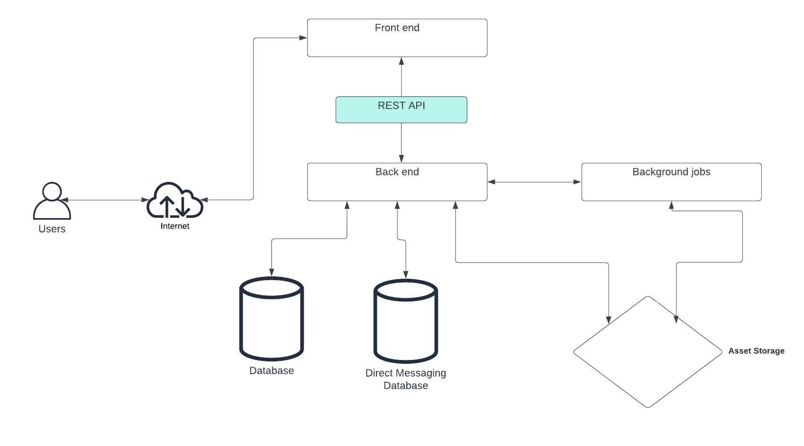
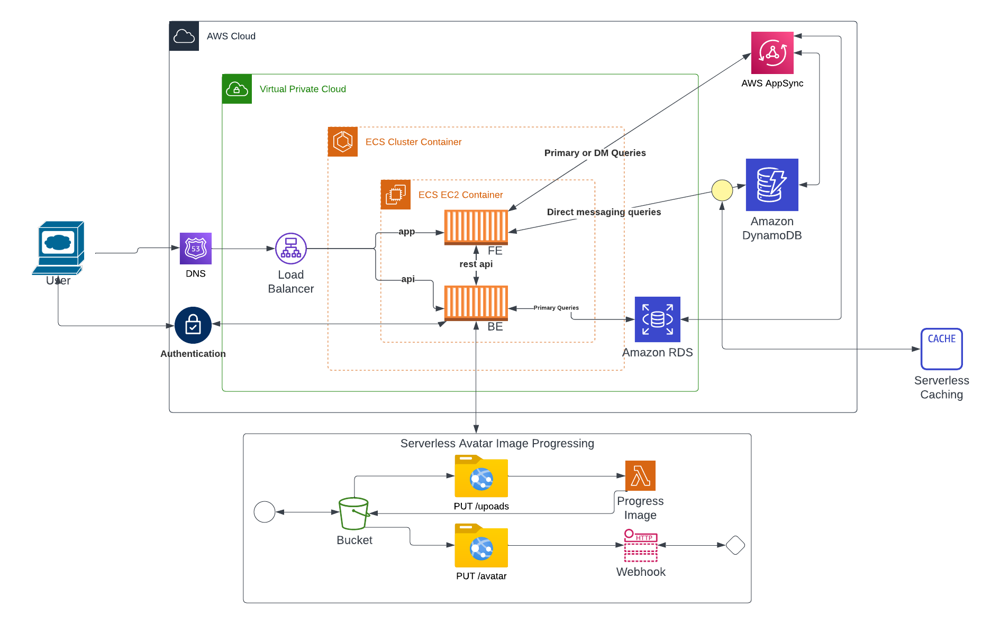
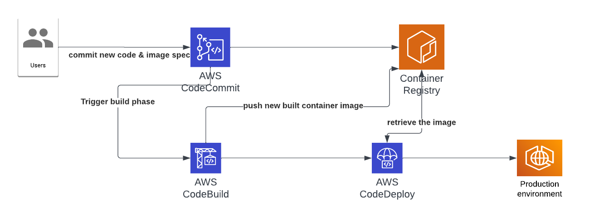

# Week 0 — Billing and Architecture

## Summary
- Tips to see the billing in local currency
- Billing panel (for Billing and Credit)
- Set up alert of usage of budget
- Cost Explorer/ Cost Allocation tags
- Understand between type of free tier (12month free, always free, and trial)
- Know how AWS calculate the bill/spend
- Security best pratices for AWS account
- new faces of AWS community builder

## DONE
- Create IAM user with admin group and set MFA
- Genereate access key and console access for IAM user
- Billing: enable billing preferences
- Set up gitpod env and aws cli for initital configuration
- Set up Budget, SNS topic, Budget alarm by AWS CLI
- Home challenges
1. Created eventbridge rule to retrieve Health Events status via SNS topic.
2. Reviewed the AWS WAT on AWS console.
3. Reviewed the tech stack and decided to reqeust new quota for maximum build project at current region for 5100 (max limit is 5000) via Service Quota console with ARN "arn:aws:servicequotas:us-east-1::codebuild/L-ACCF6C0D"

[Lucid Charts Share Link](https://lucid.app/lucidchart/bbf251e4-c2f0-427d-818d-7a5032d40095/edit?viewport_loc=-123%2C129%2C2416%2C1352%2C0_0&invitationId=inv_9e0a1590-6a7c-4d64-acb5-11f7a1a38b30)

 

[Lucid Charts Share Link](https://lucid.app/lucidchart/f9b47b43-74ab-4694-8841-7c65d00edba7/edit?viewport_loc=-724%2C-111%2C3624%2C2028%2C0_0&invitationId=inv_76438d19-a3c6-4931-bb03-b83f444b50b1)

## TODO
- Acomplished 

## References:
1. How to check perdefinde permissions 
- https://docs.aws.amazon.com/singlesignon/latest/userguide/permissionsetpredefined.html
- https://docs.aws.amazon.com/IAM/latest/UserGuide/access_policies_job-functions.html

2. How to check the quota limitation for each services
- https://docs.aws.amazon.com/general/latest/gr/aws_service_limits.html
- https://docs.aws.amazon.com/general/latest/gr/aws-service-information.html

3. How to retrieve AWS Health Events via SNS topic
- Create a SNS topic for healh event
- Create a new rule from eventbride
- Choosee correct the event source, event patterns
- Configure a target (which is next steps what to do with events : email, notification, send to webhook, event-driven actions ...)
