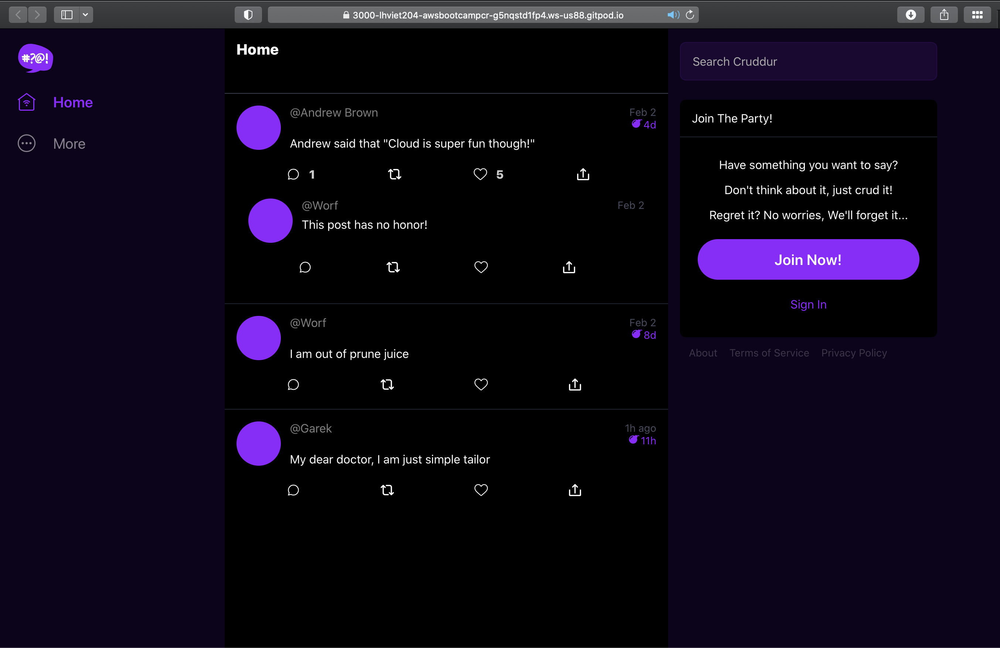
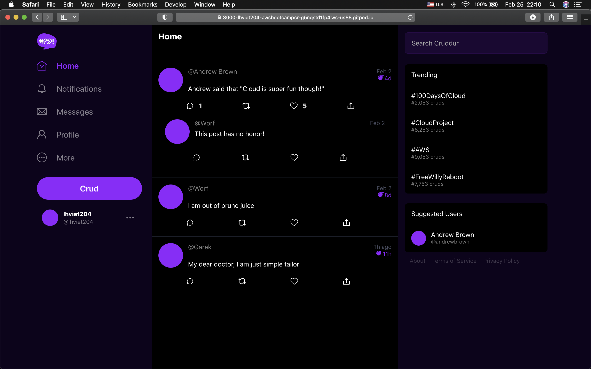
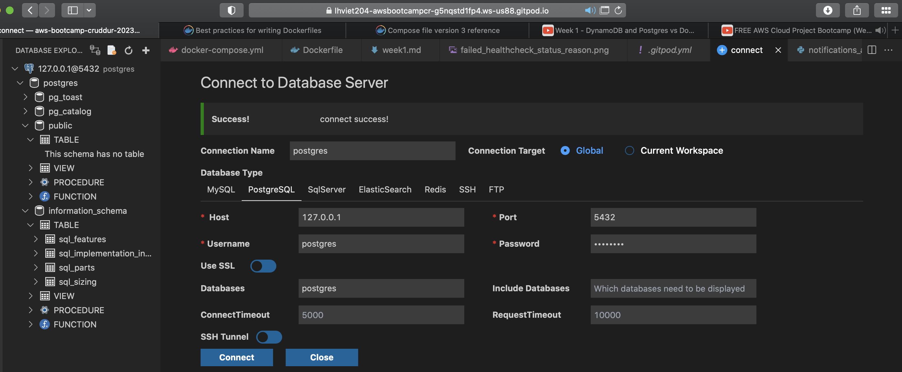
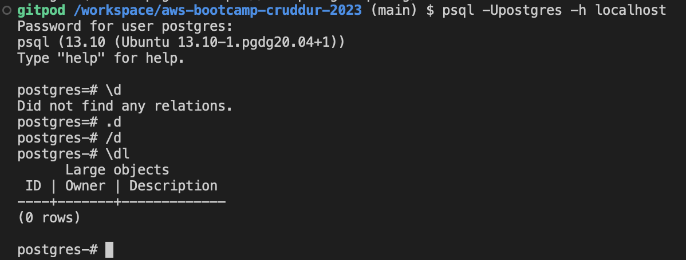
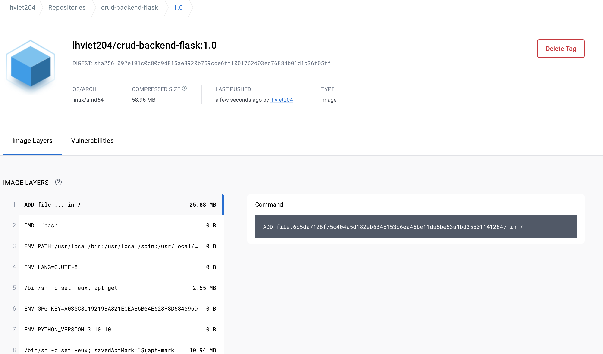
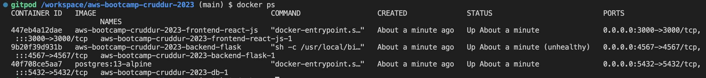
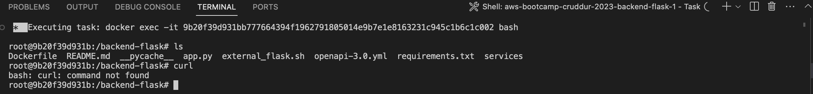

# Week 01 — App Containerization
- [Summary](#Summary)

- [Homework](#Homework)
  + [Containerize Backend and Frontend](#containerize-backend-and-frontend)
  + [Document the OpenAPI definitions](#updating-the-openapi-definitions)
  + [Updating the backend and frontend code to add notifications functionality](#updating-the-backend-and-frontend-code-to-add-notifications-functionality)
  + [DB part - DynamoDB and Postgres](#DB-part---DynamoDB-and-Postgres)

- [Homework Challenges](#homework-challenges)
  + [def](#def)
  + [Run the dockerfile CMD as an external script](#)
  + [Push and tag a image to DockerHub](#)
  + [Use multi-stage building for a Dockerfile build](#) 
  + [Implement a healthcheck in the V3 Docker compose file](#)

- [Try harder](#try-harder)
  + [get the same containers running outside of Gitpod / Codespaces](#)
  + [Launch an EC2 instance that has docker installed, and pull a container to demonstrate you can run your own docker processes](#)

## Summary

This week, I was able to follow and complete the week's homework, however I haven't solved the issue with hardcode credentinal on docker compose for postgres database. For homework challenges, I finished 6/8 challenges expect the challenges for running outside Gitpod and on EC2. For the challenges on multi-stage build and best pratice for docker file, there are a lot of space to improve, since my handons exprience is not enough. 

## Homework

#### Containerize Backend and Frontend Application
- [backend docker file](https://github.com/lhviet204/aws-bootcamp-cruddur-2023/blob/main/backend-flask/Dockerfile)
- [frontend docker file](https://github.com/lhviet204/aws-bootcamp-cruddur-2023/blob/main/frontend-react-js/Dockerfile)

#### Document the OpenAPI definition
- Commits [ae07e6f](https://github.com/lhviet204/aws-bootcamp-cruddur-2023/commit/ae07e6fec09323d875d6188fb2cc744afa9f42a7) ; [922b5b6](https://github.com/lhviet204/aws-bootcamp-cruddur-2023/commit/922b5b63c32b4a9fb784aea705a6fcdfa50b4757) 

#### Write the backend and frontend code to add notification functionality
- Commits [ae07e6f](https://github.com/lhviet204/aws-bootcamp-cruddur-2023/commit/ae07e6fec09323d875d6188fb2cc744afa9f42a7) ; [922b5b6](https://github.com/lhviet204/aws-bootcamp-cruddur-2023/commit/922b5b63c32b4a9fb784aea705a6fcdfa50b4757)

 Applicaion without authenticated account

Applicaion with authenticated account

#### DB part - DynamoDB and Postgres
Postgres DB was connected via two methods by extension and and via CLI

 Connect via extension

 Connect via CLI

## Homework Challenges

#### Run the dockerfile CMD as an external script
- Commit [1d26acf](https://github.com/lhviet204/aws-bootcamp-cruddur-2023/commit/1d26acf5fef57905e8c1aa231279abbe89ad3284)

#### Push and tag a image to DockerHub (they have a free tier)
[Container Image](https://hub.docker.com/layers/lhviet204/crud-backend-flask/1.0/images/sha256-092e191c0c80c9d815ae8920b759cde6ff1001762d03ed76884b01d1b36f05ff?tab=layers)

Image was pushed successfully on Docker Hub

#### Use multi-stage building for a Dockerfile build
- Commit [6628ab2](https://github.com/lhviet204/aws-bootcamp-cruddur-2023/commit/6628ab240d0e68d545123cdf3ef5f9edf97e6802)

#### Implement a healthcheck in the V3 Docker compose file
- Commit [3ee9ef0](https://github.com/lhviet204/aws-bootcamp-cruddur-2023/commit/3ee9ef0d50dfaa602f809858e5533be13e04c4a4)

Health check was implemented on backend docker file without checking the required 'curl' package. Here the status of container when health check was failed

After debug via container log, the root cause is missing the library, fixing via this commit [21e0dfb](https://github.com/lhviet204/aws-bootcamp-cruddur-2023/commit/21e0dfbf84e39fe4561fabfbbe3b74d3f0c07c72)

#### Research best practices of Dockerfiles and attempt to implement it in your Dockerfile
After I did the research on how to write the docker file, I decided to apply some practices: i.e. use multi-stage build, don't install unnecessary packages, Sort multi-line arguments. 

Ref links:
- [Best Practices](https://docs.docker.com/develop/develop-images/dockerfile_best-practices/)

## Try Harder
Challenges I couldn't get them done.
- Get the container running out of the GitPod, I accidently upgraded the current version of Docker Desktop, I will find the storage for upgrading on my laptop. (silly)[assets/week1/silly_things.png]
- Running the containers on EC2 free tier.