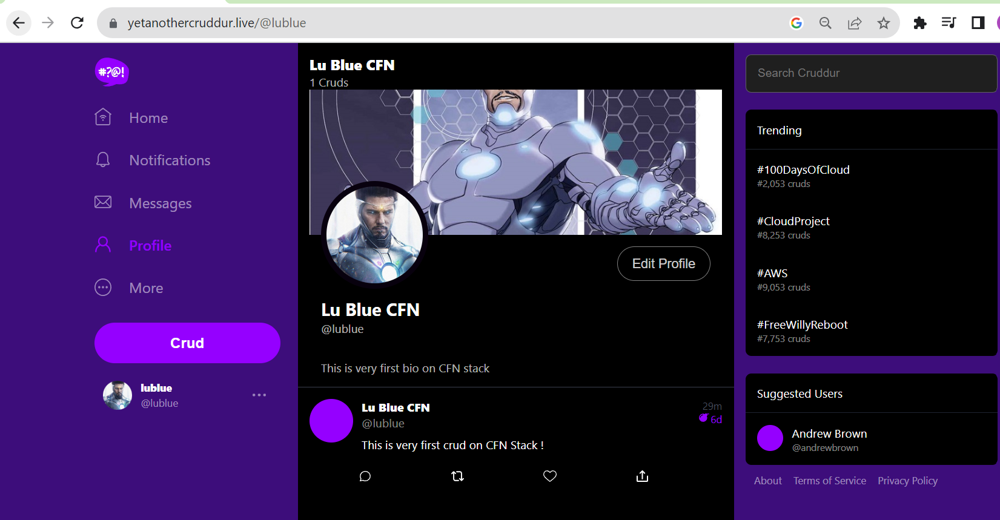
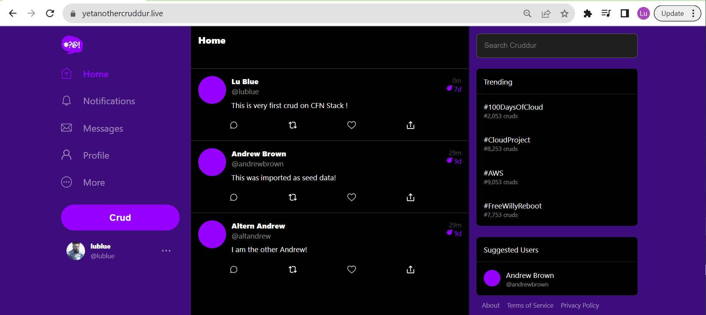
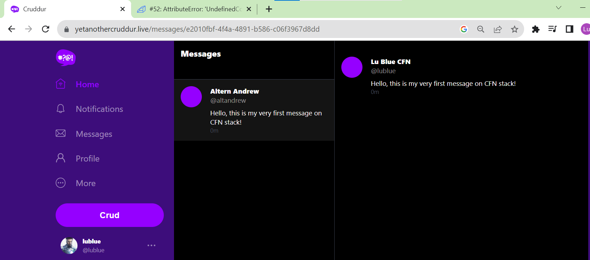
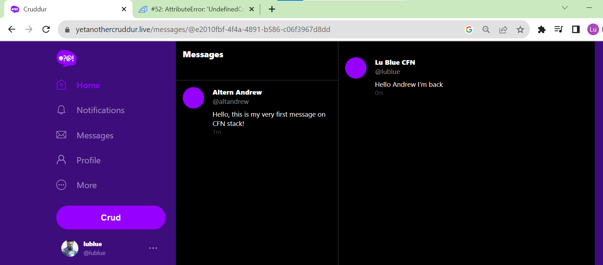
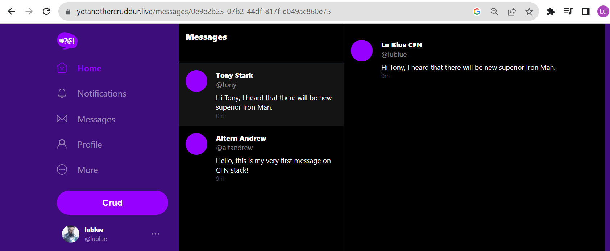
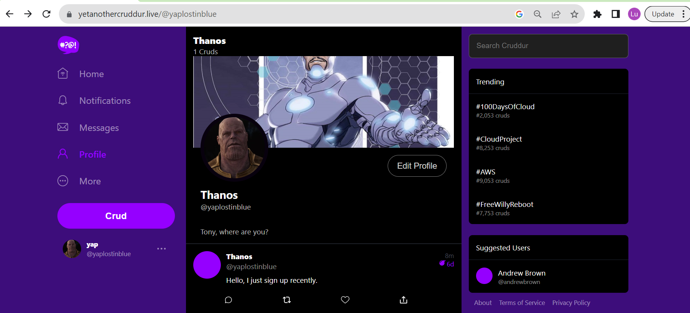
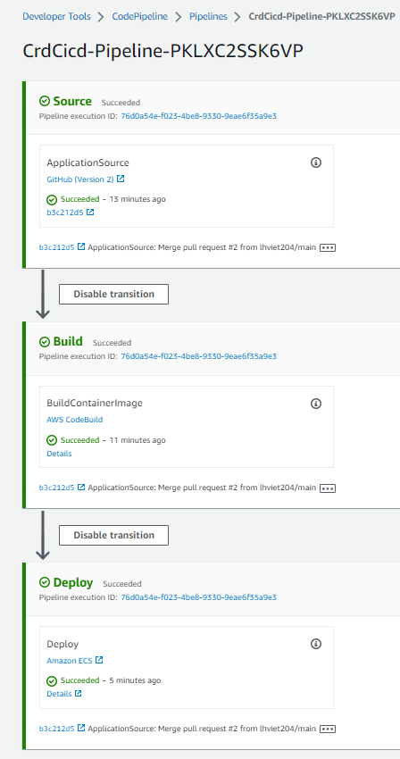

# Week 10 — CloudFormation Part 1

- [Summary](#summary)
- [Homework](#homework)
- [Implementation](#implementation)

## Summary
This week is very interesting, I did strive and learn a lot of practice to implement IAC tool such as Cloud Formation CFN. The challenges is to implement each stack one by one, when mistake happened the time to tear down all the stack and implement correctly again took a lot of time, espeically when I want to keep the current working manual configuration. What I and other student learn are how to implement AWS resources by CFN.

- How to organize the CFN project with buckets, tools, bin utilities scripts, how to pass parameter to CFN template using cfn-toml
- How to implement VPC with subnets, IGW, Route table
- How to implement ECS cluster with ALB, Target groups, Security Groups, Listener
- How to implement RDS cluster
- How to implement DynamoDB and Lambda Streaming of events
- How to implement Services on ECS Cluster
- How to implement CI/CD using AWS services like code build, code pipeline, code star
- How to implement Cloud Distribution Group with buckets, and bucket policy
- How to host static website using S3
- How to sync often the static build of website to S3 using ruby application

## Homework
The steps are described in high level instruction

1. Edit gitpod.yml to install cfn-lint, cfn-guard, cfn-toml, bundler for update gemfile
2. Create two S3 buckets for artifacts of CFN and Code Pipeline later (make sure unique)
3. Next steps to prepare the CFN stack for each of tech stacks, be aware of following squence to ensure successuflly implementation.

    a. Implement VPC stack
    
    b. Implement Cluster stack for securitygroup of database

    c. Implement DB stack
    
        1. Be aware of export local var for password of database
        2. Update the parameter store for new DB connection string
        3. Update the local var of cruddur-post-confirmation lambda script
        4. Connect to seed the data and migrate

    d. Implement Dynamodb stack to have new table name for service stack

        1. Update the config.toml of service stack for new table name
        
    e. Implement service stack, if there are any issues check back the correct ARN of parameter store and new DDB table

    f. Implement CI/CD stack, approve the new app for connection

    g. Implement new Frontend stack with Cloud Distribution Group and buckets. Before implementing delete the A record of Frontend is a must, or the stack will be failed. Copy new Distribution Group ID for configuration of static FrontEnd sync stack

    h. Deploy machine user 
    
    i. Deploy static build and sync role stack.

    j. Edit Lambda Post-confirmation for new VPC, create new SG on new VPC, edit the SG of Postgresql to allow new SG of Lambda

Here is hints for common issues which can be happend.

A. Update $PROD_CONNECTION_URL from local env of gitpod to connect and seed the data, ensure the new user name/password and endpoint of Postgresql database; aslo update the connection string for new database instance at parameter store, local env of lambda script. Don't forget to add IP of GitPod, new SG group ID, new SG Rule ID to allow connect from gitpod to PostgreSQL.
B. Update the DDBMessageTable for config of backend service for new DynamoDB.
C. Update Service Stack with correct paramters of FE and BE to ensure CORS working correctly (including the https protocol not only the domain name.)
D. Update "Access-Control-Allow-Origin" at CruddurAvatarUpload to avoid CORS issues of ProfileForm.js
E. Check the security groups between ALB, ECS. LambdaPostConformation and RDS

## Implementation

Implementation of Crddur on CFN stack

Profile Form and Crud Activity worked properly.

Message function works properly

New account can be created and post crud

Pipeline executed successully after megred main to prod.
