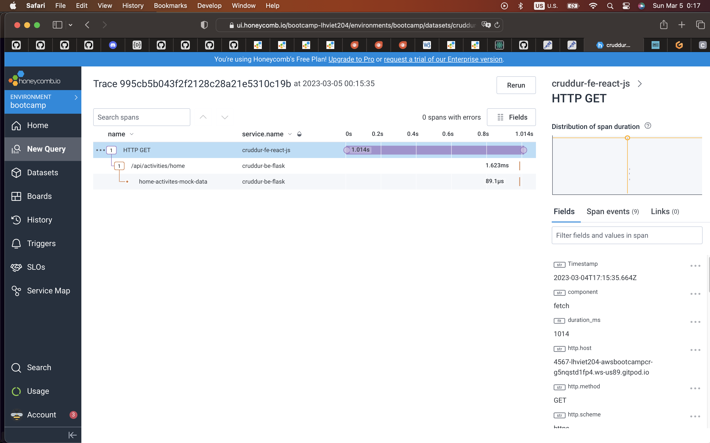

# Week 2 — Distributed Tracing
- [Summary](#summary)
- [Homework](#homework)
  - [Instrument Honeycomb with OTEL](#instrument-honeycomb-with-otel)
  - [Instrument AWS X-Ray](#instrument-aws-x-ray)
  - [Configure custom logger to send to CloudWatch Logs](#configure-custom-logger-to-send-to-cloudwatch-logs)
  - [Integrate Rollbar and capture and error](#integrate-rollbar-and-capture-and-error)
- [Homework Challenges](#homework-challenges)
    - [Instrument Honeycomb for the frontend-application to observe network latency between frontend and backend](#-instrument-honeycomb-for-the-frontend-application-to-observe-network-latency-between-frontend-and-backend-hard-)
    - [Add custom instrumentation to Honeycomb to add more attributes eg. UserId, Add a custom span]
    - [Run custom queries in Honeycomb and save them later eg. Latency by UserID, Recent Traces](#run-custom-queries-in-honeycomb-and-save-them-later-eg-latency-by-userid-recent-traces-)

## Summary
This week I learn by completing the required homework on various solutions for distributed tracings, Logging, Error Logging : i.e. Honeycomb, X-Ray, CloudWatch, Rollbar. I can implement 2 on 3 challenges, expect the add custom instrumentation due to there is no really pattern, or details which can be used to identity the userID, I need to see the challegen again when we can implement authentication to have identical user sessions.

## Homework
### <strong>Instrument Honeycomb with OTEL</strong>
Flask BE was integrated with Honeycombe, traces were sent to Homecomb to visualize

### <strong>Instrument AWS X-Ray</strong>
Traces arrived on xray AWS service by querying HTTP URL and grouping by HTTP Status codes

Details of trace on xray aws

### <strong>Configure custom logger to send to CloudWatch Logs</strong>

### <strong>Integrate Rollbar and capture and error</strong>
I did create new Rollbar project with friendly name instead of default one, and intergrate the traces with Rollbar with some traces on new UI

- Commit [610c632](https://github.com/lhviet204/aws-bootcamp-cruddur-2023/commit/610c6321091db2302047d4da60bcc706d9372e2a)

## Homework Challenges

### <strong> Instrument Honeycomb for the frontend-application to observe network latency between frontend and backend [HARD] </strong>

There are two ways to implement monitor for traces between FE and BE
- Establish trace for FE, however there is not easy way to send trace driectly from enduser browsers to HONEYCOMB, you can technically do that with new only API key with "Send Event" permission only.

So, there is only way to implement so-called collector to collect traces from all end-user browsers before sending to HoneyComb.

By doing that, two steps are required :
- Establish collector, there is example on how to use Docker Collector, since we learn about Docker compose we will apply docker compose.
- Set up instrument for FE application

#### Step 01: Establish collector
Following from honeycomb docs, the Collector consists of three components: receivers, processors, and exporters, which are then used to construct telemetry pipelines. All the components will be declared in file named "otel-collector-config.yaml" which we will mount to the docker for Collector.

#### Step 02: Set up instrumentation
- Prepare the library from OT, and ensure it's included in package.json
- Prepare the tracing.js plus auto-propogate between FE and BE
- Add import 'tracing.js' on the index.js
- Input the local env for docker compose, OTEL collector yaml, and tracing.js

Commit [c42b97b](https://github.com/lhviet204/aws-bootcamp-cruddur-2023/commit/c42b97bb3ce02342a53b3663cd27827074ffd62d)

Traces are now being propogate between the FE and BE, the nature of challenge is interesting, the hard part is the Honeycomb documetation. Docs made me confused that I don't know whether I should use 
collector, or custom proxy ...

### <strong>Run custom queries in Honeycomb and save them later eg. Latency by UserID, Recent Traces ...</strong>
On Honeycomb we can save usefull queries to use later, or use between team member when dashboard is shared.

### <strong>Add custom instrumentation to Honeycomb to add more attributes eg. UserId, Add a custom span</strong>

## References
https://docs.honeycomb.io/getting-data-in/opentelemetry/browser-js/#opentelemetry-in-the-browser

https://docs.honeycomb.io/getting-data-in/otel-collector/

https://github.com/open-telemetry/opentelemetry-collector/blob/main/config/configtls/README.md

https://github.com/open-telemetry/opentelemetry-collector/blob/main/config/configtls/README.md

https://opentelemetry.io/docs/instrumentation/js/exporters/

https://docs.honeycomb.io/getting-data-in/otel-collector/#cors-errors

https://docs.honeycomb.io/getting-data-in/opentelemetry/browser-js/

## Try Harder