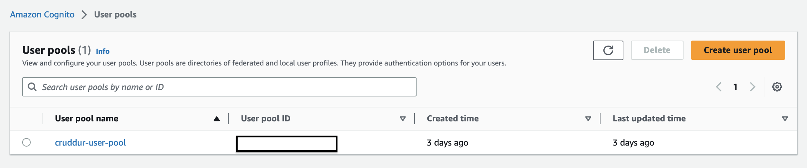
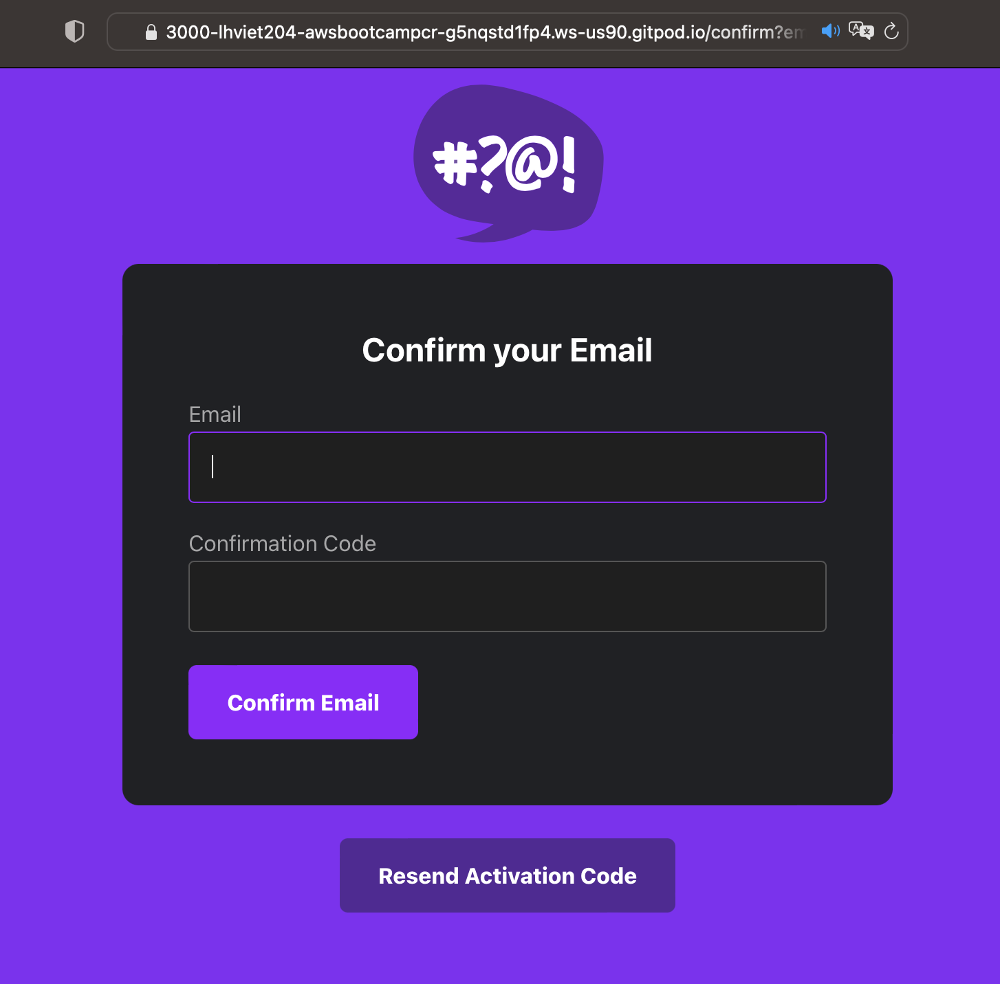
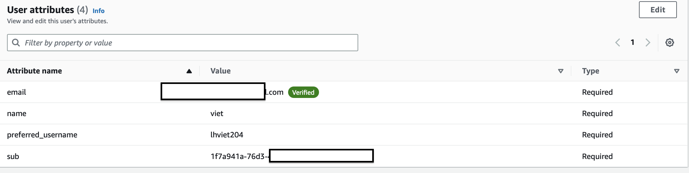
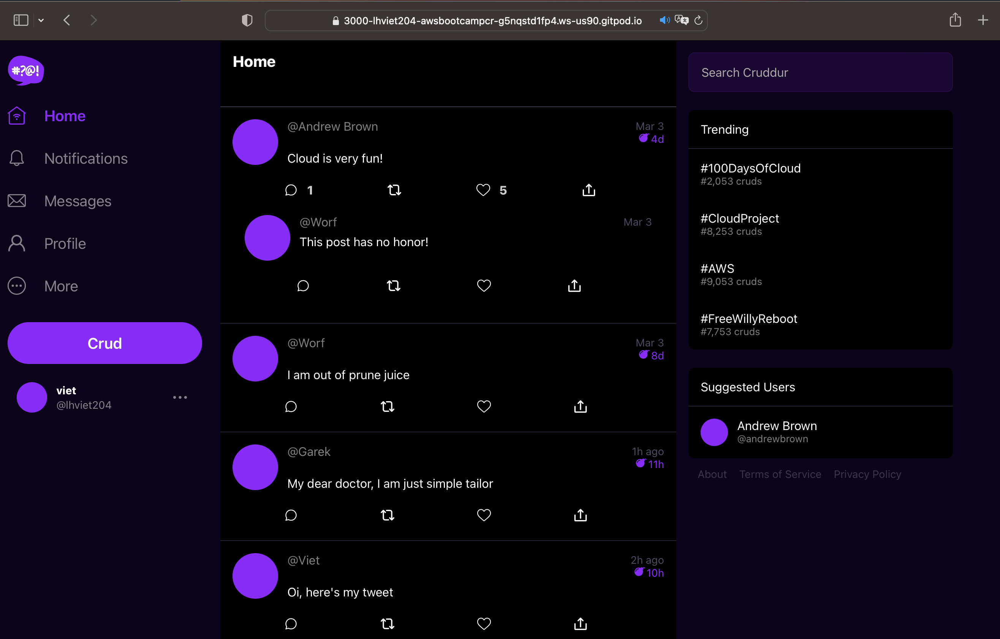
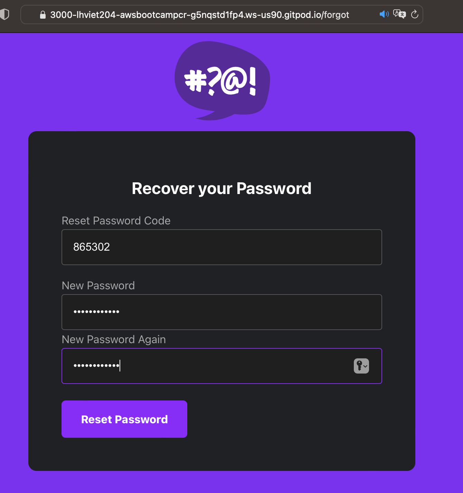
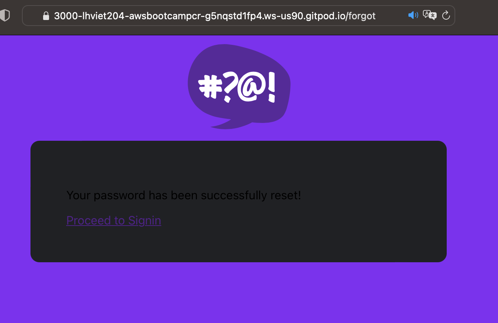

# Week 3 — Decentralized Authentication
- [Summary](#summary)
- [Homework](#homework)
    - [Setup a Cognito User Pool](https://github.com/lhviet204/aws-bootcamp-cruddur-2023/blob/main/journal/week3.md#homework)
    - [Implement Custom Signin, Signup, Confirmation and Recovery Pages](https://github.com/lhviet204/aws-bootcamp-cruddur-2023/blob/main/journal/week3.md#implement-custom-signin-signup-confirmation-and-recovery-pages)
- [Homework Challenges](#homework-challenges)
    - [Decouple the JWT verify from the application code by writing a  Flask Middleware](https://github.com/lhviet204/aws-bootcamp-cruddur-2023/blob/main/journal/week3.md#)
    - [Decouple the JWT verify by implementing a Container Sidecar pattern using AWS’s official Aws-jwt-verify.js library](https://github.com/lhviet204/aws-bootcamp-cruddur-2023/blob/main/journal/week3.md#decouple-the-jwt-token-validation)
    - [Decouple the JWT verify process by using Envoy as a sidecar https://www.envoyproxy.io/](https://github.com/lhviet204/aws-bootcamp-cruddur-2023/blob/main/journal/week3.md#decouple-the-jwt-token-validation)
    - [Implement a IdP login eg. Login with Amazon or Facebook or Apple.](https://github.com/lhviet204/aws-bootcamp-cruddur-2023/blob/main/journal/week3.md#implement-a-idp-login)
    - [Implement MFA that send an SMS (text message), warning this has spend, investigate spend before considering, text messages are not eligible for AWS Credits]

## Summary
This week I learn about how to configure Amazon Coginto and intergrate with ReactJS and Python. I can implement again followng the required homework to have fuctional Cruddur application: like Sign Up, Confirmation, Sign In, Home Page, Recovery Password.

## Homework
### <strong>Setup a Cognito User Pool</strong>
AWS Congnito User Pool configured following week3 videos

### <strong>Implement Custom Signin, Signup, Confirmation and Recovery Pages</strong>
Cruddur feature pages are implemented via below commits
- Commits [8b7e743](https://github.com/lhviet204/aws-bootcamp-cruddur-2023/commit/8b7e743ceeb12e1b9fe581eaa2fe7a7093cac432) [a91077b](https://github.com/lhviet204/aws-bootcamp-cruddur-2023/commit/a91077ba53ffc739fac485f48d989c577283c73c)

User can signup successfully with confirmation page

Attributes of users on AWS Cognito after signing up via SignUp Page.

User can signin successfully from created account from previous stepx

User can reset password via Recovery Page feature

## Homework Challenges
### <strong></strong>
### <strong>Decouple the JWT verify from the application code by writing a  Flask Middleware</strong>
- Commit [25c1a13](https://github.com/lhviet204/aws-bootcamp-cruddur-2023/commit/25c1a13e256300260af200f714c7525009a6ef94)

### <strong>Decouple the JWT token validation</strong>
I decide to group two challegnes into one sicne they share same requirements and design pattern.
- Milestone 1: Decouple the JWT token validation using offical aws-jwt-verify.js library as sidecar container pattern
- Milestone 3: using Envoy to route jwt token validation to our new aws-jwt-verify
- Milestone 3: using builin plugin/fuction (http_fitler) from Envy to verify JWT token. https://www.envoyproxy.io/docs/envoy/latest/configuration/http/http_filters/jwt_authn_filter#config-http-filters-jwt-authn

### <strong>Implement a IdP login</strong>
[TO DO] I did some homework search, and decide to try with Okta since they have free tier.
