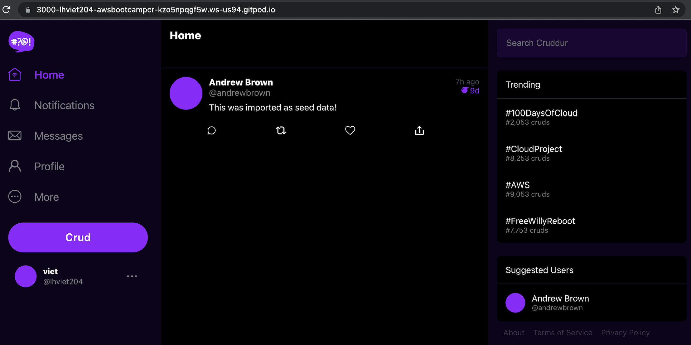

# Week 4 — Postgres and RDS

- [Summary](#summary)
- [Homework](#homework)
- [Homework Challenges](#homework-challenges)

## Summary
This week I learn three areas on AWS(RDS, Lambda, Network Security); on programming and project structure (how to establish DB script in bash for setup, connect, drop, create; how to manage SQL scripts seperately), on Python (splating, Interpolation, how to edit mutable python tuple object). There are many weeks I need to catch up with class. Continue from the previous setences, this week I start with the remaining of this week. AWS RDS data is created via AWS CLI and allowed the connection from GITPOD. I can load the seed data from AWS RDS from FE. Next step is to create AWS Lambda on AWS.

## Homework
- Since we modified the schema of DB to not allow NULL data, so we need to modify the db-seed data to be able for db-setup script.

- After we can setup the DB seed, we can load the seed data from FE.

