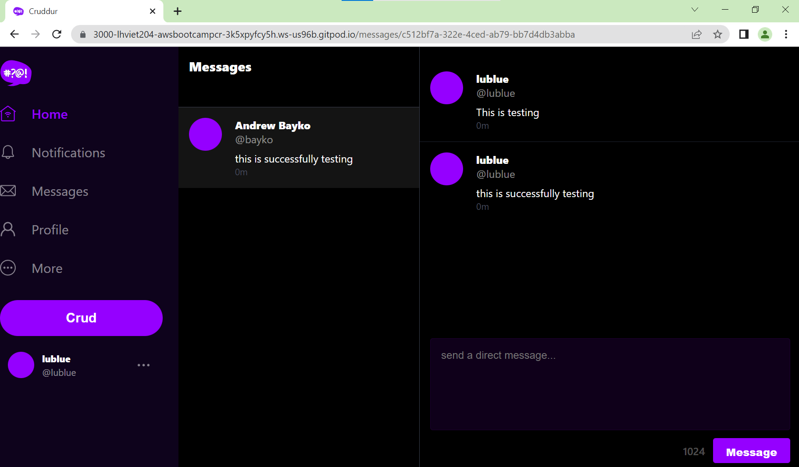

# Week 5 — DynamoDB and Serverless Caching

This week I've learn so far how database design modeling can be super hard, strength and weakness on using RDS and NoSQL databases, how to implement again scripts utilities on working with databases, especially using boto3 also. There are key points of using DynamoDb as NOSQL database, how hard it is for single table design, the concentrate between strings on the pk, sk is brilliant idea.  For AWS areas, there are new services I learn about like VPC endpoint, how to configure lambda to listen on the new events on DynamoDB.  

Applications is implemented successfully with all patterns.

Highlevel instructions of implementation is described below:

- Start to implement dynamodb stream
    - To configure VPC endpoint
    - To implement Python lambda function
    - To enable stream on DynamoDB
    - To add py lambda as a trigger on the stream
    - To grant IAM role for lambda to read dynamodb stream events
    - To grant IAM role for lambda to update table items
    - IAM policy is attached to the role
        - Actions : dynamodb putties, query, deleteitem
        - Resource table and index need to specify ARN; so ideally is create after dynamodb is established

Implememtation successully to create message, with message group on prod environment
