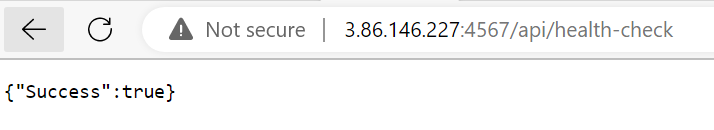
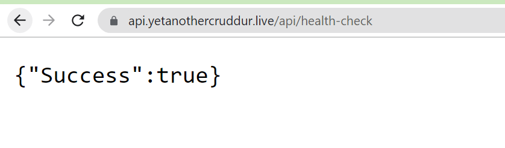
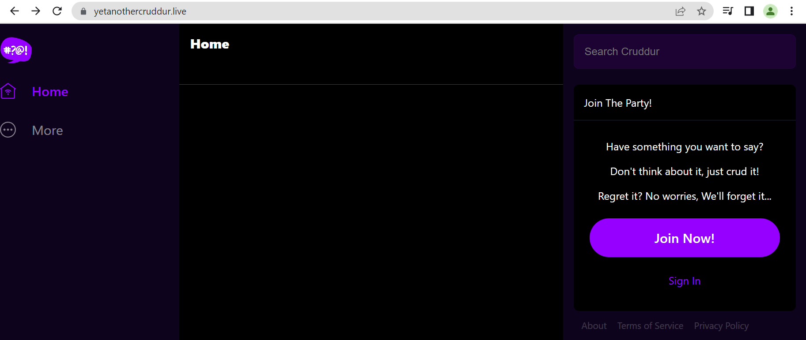
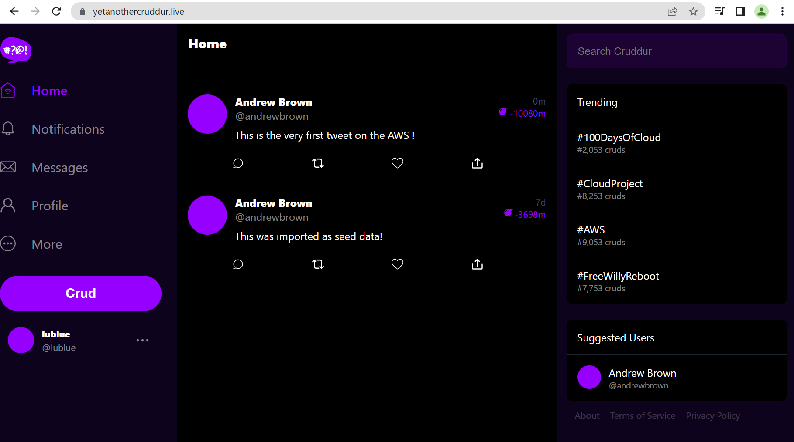

# Week 6 — Deploying Containers

- [Summary](#summary)
- [Homework](#homework)
- [Implementation](#implementation)
## Summary
"Those weeks" I has learnt and gained many experiences from various areas, especially end-to-end progress to publish the modern applications consisting of front and back end into AWS environment with in-use AWS services like Route53, ALB, Target Group, ECS, ECR, RDS, DynamoDB, Cloudwatch logs, IAM roles ... The app is running normally on my own domain.

High level steps consist of
- Create ECR for python, backend, frontend repository
- Build and Push new images
- Create ECS and Register task-definitions, services, security groups for ECS with correct IAM roles for service execution/task roles.
- Create Route53 public hosted-zones
- Create Public certificates for domains from ACM
- Create Target Groups, Security Groups for ALB, Create ALB, Listener and Manage rule to forward/redirect
- Create A records for FE and BE pointing to ALB
- Revise service and task definition with ALB supporting

## Implementation
- Health check request returend OK status by IP Address.

- Health check request returned OK status with domain name.

- Frontend service was implemented successfully.

- Backend service was implemented successfully.

