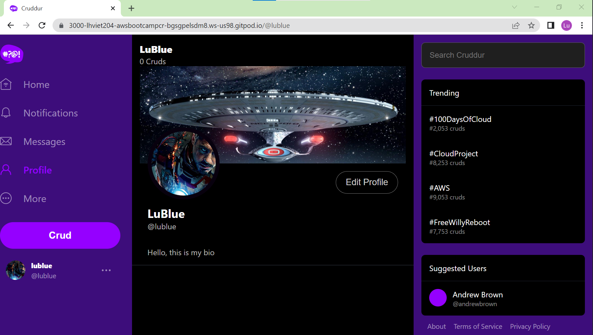

# Week 8 — Serverless Image Processing

- [Summary](#summary)
- [Homework](#homework)
- [Implementation](#implementation)

## Summary
This week, I've learned about CDK to create AWS Services like Lambda, S3 bucket, IAM roles for Cruddur uploading avatars for User Profiles. The concept for now is user uploading images to AWS S3 folder named original, the images will be progressed by lambda with js sharp library to resize the pictures and send back confirmation to our application webhook (?)

In addition, I also learn about fundamental of AWS CDK. There are many construct type of data are being used i.e. Level 1, Level 2, Level 3. Level 1 is the native of cloud formation, level 2 is common pattern of using AWS services, level 3 is purely opinionated stack. Also how to leverage aws cdk synth to check the stack before deployment.

Design ideas on how to arch the stack, the resources ... to avoid the misconfiguration, mistakes.
How to use UI of AWS Cloud Formation
How to reference another AWS resources into the stack without deleteing them.

## Homework

High level of implementation is described as below:
- Setting CDK folder named "thumbing-serverless-cdk"
- Installing the required library "aws-cdk"
- Initing the CDK app by "type-script"
- Boosting trapping the folder for each region implemeting
- Implemeting the stack code with S3, Lambda, env library
- Implemeting the utilit scripts to upload data, clear data of samples

## Implementation

- All the features/ functions of Profile Form was implemented successfully.

- Actually after the refactor the functions are also working.

