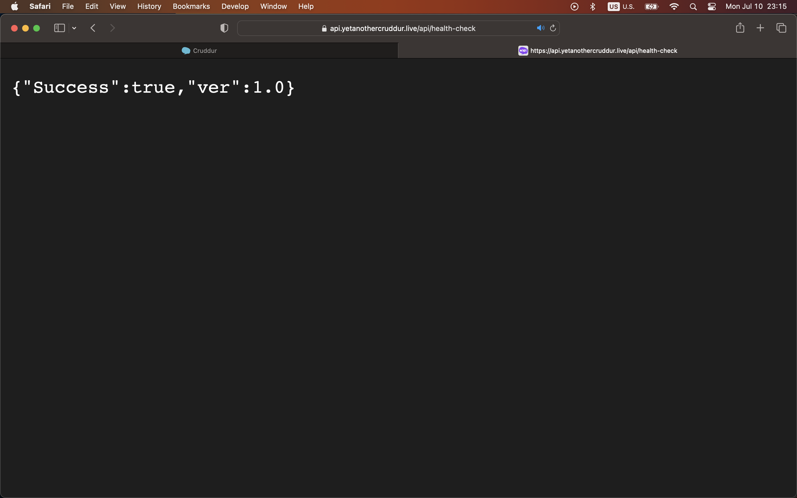
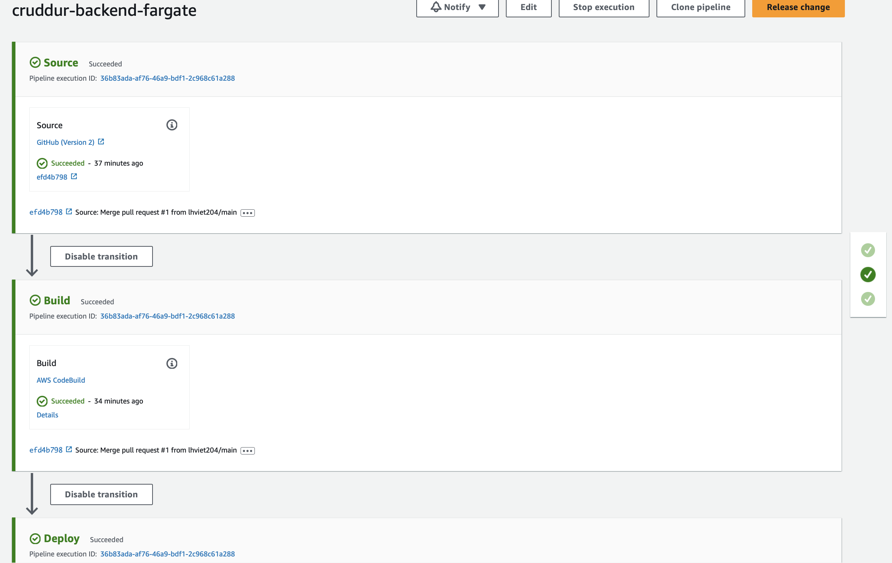
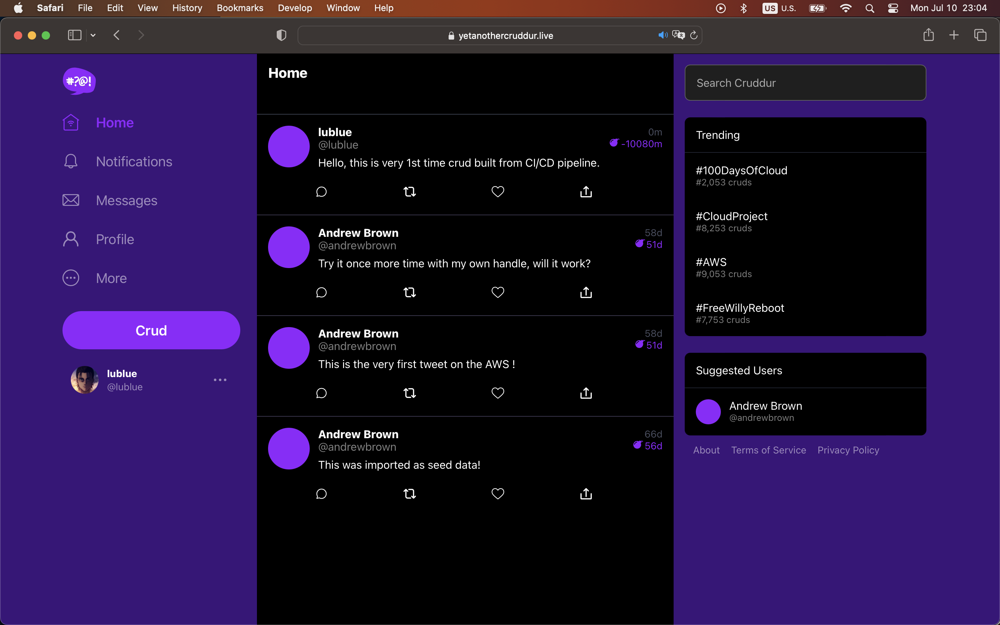
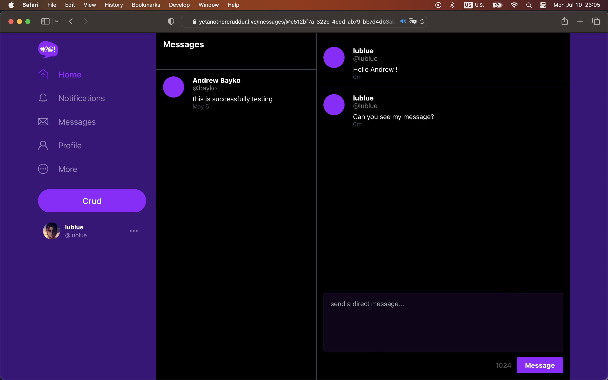

# Week 9 — CI/CD with CodePipeline, CodeBuild and CodeDeploy

- [Summary](#summary)
- [Homework](#homework)
- [Implementation](#implementation)

## Summary
Those weeks, I've learnt how to configure CI/CD pipepline to delivery software using AWS services : CodeBuild, CodePipeline. Git strategy will be implemented on 'prod' branch, whenever new release is merged into prod branch, the request will trigger the pipeline to build the worload and deploy on ECS Fargate mode. Only Back end will be delivered by pipeline, FE will stay the previous approaching from Gitpod. New ways to build FE will be implemented on week Cloud Formation.

## Homework

Steps in high level consist of:

### Requirements
- Prepare the spec for buildspec.yml with variables
- Prepare the role for ECR to build
- Create new branch named prod
- Build the new image for ECR and push, and deploy

### Prepare the build project
- name: cruddur-backend-fargate
- source: choose github as source provider, choose the project and the previous created branch named prod
- env: 
    - Select managed image, Amazon Linux 2, standard runtime, select lastest image, env as Lunux, privileged
    - Create new service role automatically named as codebuild-cruddur-backend-flask-bake-image-service-role
    - Set timeout to 20m for shorter timeout duration., no any new certifications, compute resource as 3gm memory and 2vcpus
    - Use buildspec file previous
    - No artifacts
    - Select cloudwatch logs, set group name as /cruddur/build/backend-flask, stream name as backend-flask.
    - Then check the service role, attach the new policy from ECR to build backend
    - Start Build

### Preapre the Codepipeline
Configure as follow steps:
- Name
- Allow to create service roles automatically, left default settings for location and managed keys from advanced settings
- Install new app for source stage of Git hub v2, select the repo with prod branch
- Select "start the pipeline when sourcecode change"
- Build Stage: select AWS Codebuild as buildprovider from previous build project.
- Deploy stage: seclet your ECS cluster, and Backend services

### Check for successfully executed pipeline,

By change the version of healthcheck from app.py of Backend flask to see new version deployed.

## Implemention

- Completed configured pipeline will be:

- Cruddur application was implemented into prod AWS env by CI/CD pipeline

- Functions are working properly

