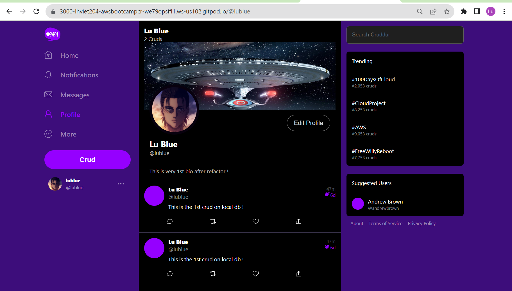

# Week X — CleanUp

- [Summary](#summary)
- [Homework](#homework)
- [Implementation](#implementation)

## Summary
This week was very speical since I completed this week before implemeting CFN stack for the current Cruddur. What I learnt from this week is various:
- How to refactor the FLASK applications following design patter using routes and decorator, and seperated folder for required libraries. Doing that the code base is more cleaner.
- How to implement error handling when there are potential issues

## Homework

The steps are described in high level instruction
- Preapare the .py code for each libraries using from app.py
- Move the import from app.py to each library file.
- New route folder for each .py code consisting of general, user, messsage, activities
- Append lines of routes
- Standardize all the variables from codebase
- Implement error handling for FE, revise the css for better.

## Implementation
After refactoring the code base, docker compose up to test all the functions of Cruddur to ensure it works properly.

Be aware of inputting additional HTTP method at cors.py and users.py to let profileform working [c96b030](https://github.com/lhviet204/aws-bootcamp-cruddur-2023/commit/c96b030beea455686d770367b5b661c4df648a3c) and ensure the origin ""Access-Control-Allow-Origin":" from ruby lambda CruddurAvatarUpload is correct with new gitpod env.

Impelementation on gitpod env

